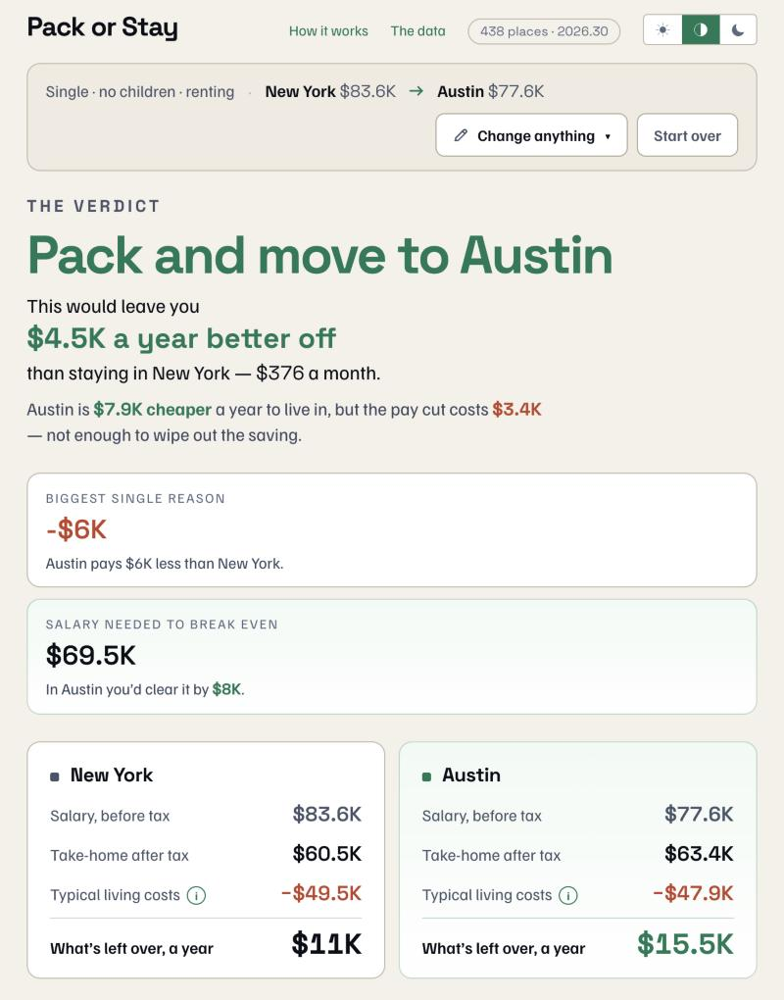

# Pack or Stay

**Will moving actually leave you with more money?** Try it at [packorstay.com](https://packorstay.com).



Pick two US metro areas and enter a salary. You get one number: how much more or less you would have left each year after the move. It counts income tax, housing, cars and everyday costs. The answer can be negative, and often is.

Free. No accounts, no tracking, no database.

## Why it exists

Most cost-of-living comparisons stop at prices. That misses the things that swing the answer.

- A pay cut can outweigh a cheaper city entirely, so each salary prefills with typical local pay.
- Cars can swamp everything else. New York with no car against Austin with two is a swing of about $15,000 a year. A price index does not see it, because it measures prices and not how many cars you need.
- No state income tax is not the same as low tax. Property tax in Texas and New Hampshire often claws the saving back.
- Most households do not itemize, so the tax break for owning a home is often worth exactly $0.

## What is in it

- 438 places: 387 metro areas, plus a "rest of state" option for each state and DC.
- Federal income tax, payroll tax, and state income tax for all 50 states and DC. Local income tax for 13 named cities, with state averages elsewhere.
- Rent or mortgage, property tax, cars and household spending, sized to the household and its income.
- A share link that carries the whole comparison in the URL. It is pinned to the dataset it was made with, so an old link keeps giving the same answer.
- A [methodology page](https://packorstay.com/methodology) and a [data page](https://packorstay.com/data) that label every figure with its source and what kind of number it is.

What it gets wrong is written down too. [docs/STATUS.md](docs/STATUS.md) lists the known gaps in priority order.

## How it is built

Next.js, React and TypeScript. The calculation engine is plain TypeScript with no framework code in it, and a lint rule keeps it that way. Datasets are committed to the repo and bundled at build time, so there are no runtime API calls and nothing to pay for. A GitHub Action refreshes the data every quarter and opens a pull request. It never merges on its own.

The full specification, with the decisions and the reasons behind them, is in [PROJECT.md](PROJECT.md).

## Run it locally

```bash
npm install       # once
npm run dev        # local dev server
npm run test       # engine unit tests
npm run test:watch # tests in watch mode
npm run typecheck  # TypeScript, no emit
npm run lint       # ESLint, including the engine boundary rule
npm run check      # typecheck + lint + test
npm run build      # production build
```

## Layout

| Path | Contents |
|---|---|
| `engine/` | The calculation core. **Framework-free**. See `engine/README.md` |
| `engine/current-dataset.ts` | The one release bundled eagerly. Older ones load on demand |
| `data/` | Immutable dated datasets. **Never hand-edited**. See `data/README.md` |
| `scripts/` | The data pipeline that generates `data/`. See `scripts/README.md` |
| `lib/` | UI-side helpers (share-link encoding, formatting adapters, the shared form state) |
| `components/` | The two screens, `setup.tsx` and `answer.tsx`, and the fields they share |
| `app/` | Next.js App Router pages |
| `PROJECT.md` | Full product specification, decisions and rationale |
| `docs/STATUS.md` | What is built, the known gaps in priority order, and how to rebuild the data |

## Data

Every number comes from a free, public source: BEA Regional Price Parities, Census ACS, BLS
Consumer Expenditure Survey, Freddie Mac's mortgage rate survey (via FRED), IRS, SSA, the Tax
Foundation, and individual city revenue departments. HUD Fair Market Rents were specified originally and rejected, because HUD publishes on
its own areas, which do not map cleanly onto the metros used here. Nothing is paid for, and
there are no runtime API calls: datasets are committed to this repo and bundled at build time.

The Tax Foundation compilations are CC BY-NC 4.0; everything else is public domain. The
[data page](https://packorstay.com/data) lists the source, the licence, and what kind of number
each figure is.

This project is permanently non-commercial: no ads, no paywall, no affiliate links.

**Not financial, tax or legal advice.** Estimates only.

Built by [Dmitri](https://heydmitri.com/).
